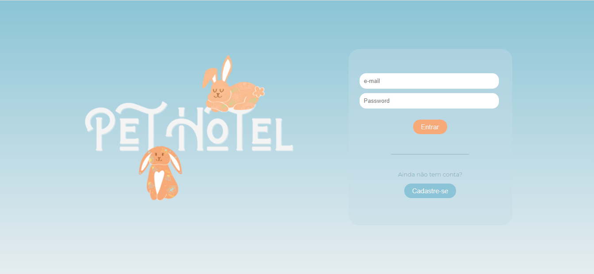

<h1>Pet Hotel</h1>

Pet Hotel is a full stack application developed as the final project of Ironhack bootcamp.

The website was built using the MERN Stack. 

This was a group project developed by <a target="_blank" href="https://github.com/lauraferraz5">Laura Ferraz</a>, <a target="_blank"  href="https://github.com/rodrigomatosrj">Rodrigo Matos</a> and <a target="_blank" href="https://github.com/thaliaberger">Thalía Berger</a>.

<h2>The Project</h2>

Our project consists on a website of a hotel for pets, with a homepage that contains information about the hotel, pages to register the client, their pets, to book the reservation, and a page that centralizes all this information.

The client can register their pets, make the reservation and manage their accomodation.

The Hotel accepts four types of pets: dog, cat, rabbit and <video src="./src/video/dino.mp4"></video> . The client informs the name, size, gender, allergies, deseases and recommendations about their pets.

To book a new reservation is very simple. By clicking on the "Agendar estadia" button, the client is redirected to a page where is possible choose the dates and check the available rooms. There are three types of room: standard, suite and luxury.

We chose this theme because of our desire to work with something related to pets, and the hotel was the project that we most indetified with.

<h2>Where you can find our project</h2>

<!-- 
The website was deployed on Vercel. Click <a target="_blank" href="https://pet-hotel.vercel.app/">HERE</a> to access the page!

It was also hosted on AWS. Check it clicking <a target="_blank" href="http://ec2-52-14-163-166.us-east-2.compute.amazonaws.com/">HERE</a>!
 -->

The website is hosted on AWS. To check it click<a target="_blank" href="http://ec2-52-14-163-166.us-east-2.compute.amazonaws.com/">HERE</a>!

And <a target="_blank" href="https://www.canva.com/design/DAEQb9SvCgU/fI6LmienIauDueBBYCQjEQ/view?utm_content=DAEQb9SvCgU&utm_campaign=designshare&utm_medium=link&utm_source=publishsharelink#9">HERE</a> you can find our project presentation!

